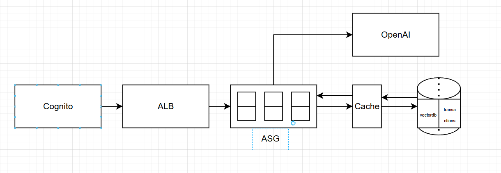

# Architecture

## Overview
- Stateless chatbot API.  
- Runs entirely on AWS Free Tier for demo purposes.  
- All design choices are made to fit under free tier limits, but each component can be upgraded to larger instances or managed services without code changes.  

## Components
- **Auth**: Cognito (JWTs for user sessions).  
- **App Servers**: Stateless compute (EC2 Auto Scaling Group) behind an ALB.  
- **Cache**: Redis for ephemeral session data, rate limiting, and last-N messages.  
- **Database**: Amazon RDS PostgreSQL with `pgvector` extension for semantic search and relational data.  
- **Object Storage**: S3 for large attachments and archived transcripts.  
- **LLM Provider**: OpenAI API for inference.  

## Data Flow
1. User request → ALB → stateless App Server.  
2. App validates JWT with Cognito.  
3. App fetches required context:  
   - **Fresh history**: last 10–20 messages (Redis/Postgres).  
   - **Summary**: rolling conversation summary (Postgres).  
   - **Relevant past context**: semantic retrieval using pgvector.  
4. App calls LLM API.  
5. Response streamed back to the client.  
6. Message + metadata stored in Postgres; embeddings updated for retrieval.  

## Diagram

