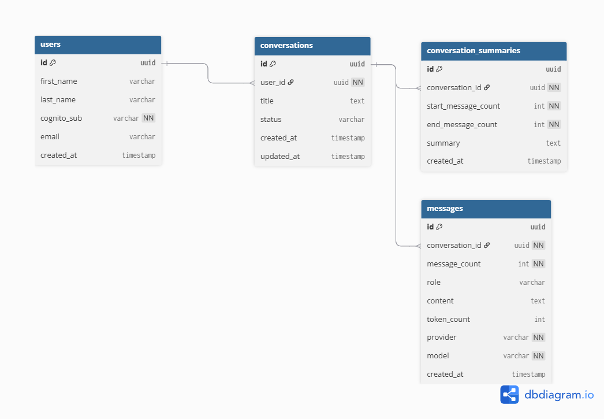

# Data Model

This document describes the core entities that power the chatbot backend.  
The schema is designed to support user management, conversations, messages, and rolling summaries.

---

## Entities

### Users
Represents an authenticated person in the system.

**Fields**
- `id (uuid, pk)` — unique identifier  
- `first_name (varchar)` — optional first name  
- `last_name (varchar)` — optional last name  
- `cognito_sub (varchar, unique, not null)` — identifier from Cognito  
- `email (varchar)` — optional email  
- `created_at (timestamp)` — when the user was created  

---

### Conversations
Represents a single chat thread belonging to a user.

**Fields**
- `id (uuid, pk)` — unique identifier  
- `user_id (uuid, fk → users.id)` — owner of the conversation  
- `title (text)` — optional name for the thread  
- `status (varchar)` — e.g., `active`, `archived`  
- `created_at (timestamp)` — creation time  
- `updated_at (timestamp)` — last updated time  

**Relationships**
- One user → many conversations  
- One conversation → many messages  
- One conversation → many summaries  

---

### Messages
Represents a single message (turn) in a conversation.

**Fields**
- `id (uuid, pk)` — unique identifier  
- `conversation_id (uuid, fk → conversations.id)` — which conversation this belongs to  
- `message_count (int)` — sequential counter within a conversation  
- `role (varchar)` — who sent it (`user`, `assistant`, `system`)  
- `content (text)` — message body (text or structured payload)  
- `token_count (int)` — token usage (optional)  
- `provider (varchar, not null)` — LLM provider used  
- `model (varchar, not null)` — model name used  
- `created_at (timestamp)` — when message was created  

**Relationships**
- Many messages per conversation  

---

### Conversation Summaries
Rolling summaries of conversations to compress history.  
Each summary covers **all messages up to a given message_count**.

**Fields**
- `id (uuid, pk)` — unique identifier  
- `conversation_id (uuid, fk → conversations.id)` — conversation this summary belongs to  
- `end_message_count (int, not null)` — last message included in this summary  
- `summary (text)` — summary text  
- `created_at (timestamp)` — when summary was created  

**Relationships**
- One conversation → many conversation_summaries  

---

## Notes
- **Message numbering**: `message_count` increments per conversation.  
- **Summaries**: each new summary is cumulative, always covering `1 → end_message_count`.  
- **Extensibility**: additional entities (documents, embeddings, usage events) can be added later without breaking the core schema.
